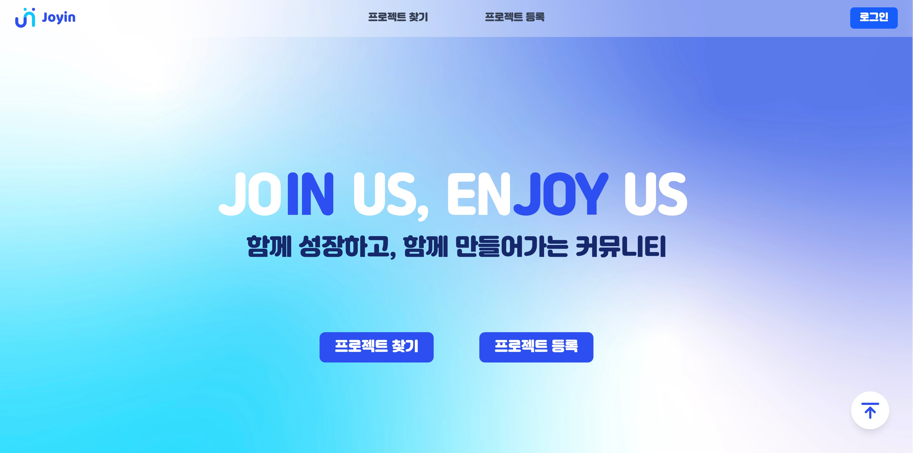

# JOYIN (조인) - 사이드 프로젝트 팀원 매칭 플랫폼

## 사이드 프로젝트, 이제 JOYIN에서 함께할 팀원을 찾아보세요\!

**[🚀 JOYIN 배포 페이지 바로가기](https://final-project-team9.vercel.app)**

**개발자, 디자이너, 기획자** 누구나 아이디어를 공유하고 협업할 동료를 만날 수 있는 곳,<br> 멋쟁이 사자처럼 프론트엔드 부트캠프 14기 파이널 프로젝트 **9in구직** 팀이 만들었습니다.

---

## 프로젝트 소개

**JOYIN**은 사이드 프로젝트를 시작하고 싶지만 함께할 팀원을 찾기 어려웠던 경험을 바탕으로 탄생했습니다. 아이디어는 있지만 실현하기 어려웠던 분들, 새로운 기술 스택을 경험하고 포트폴리오를 쌓고 싶은 분들 모두 JOYIN에서 최적의 팀원을 만나 프로젝트를 현실로 만들 수 있습니다.

**주요 목표:**

- **손쉬운 팀 빌딩:** 직관적인 프로젝트 등록 및 지원 프로세스 제공.
- **다양한 프로젝트:** 웹/앱 개발, AI, 게임 등 다양한 분야의 프로젝트 탐색 기회 제공.
- **성장 기회:** 새로운 동료들과 협업하며 기술 역량 및 포트폴리오 확장 지원.

---

## 목차

- [주요 기능](#주요-기능)
- [기술 스택](#-기술-스택)
- [설치 및 실행](#설치-및-실행)
- [사용 방법](#사용-방법)
- [프로젝트 구조](#프로젝트-구조)
- [기여 가이드라인](#기여-가이드라인)
- [라이선스](#라이선스)
- [팀원 소개](#팀원-소개)
- [프로젝트 현황](#프로젝트-현황)

---

## 주요 기능

### 1\. 사용자 인증 및 온보딩 (Auth & Onboarding)

- **안전한 인증:** `Supabase Auth`를 활용한 이메일 OTP 기반 회원가입 및 '아이디' 기반 2단계 로그인 구현.
- **계정 복구:** 이메일 OTP 인증을 통한 아이디 찾기 및 비밀번호 재설정 기능 제공.
- **체계적인 온보딩:** 회원가abilità 다음 3단계 온보딩 프로세스 진행:
  1.  **프로필 설정:** `Supabase Storage` 연동 프로필 이미지 업로드, 닉네임(중복 확인), 포지션, 경력, 한 줄 소개 입력.
  2.  **기술 스택 선택:** `Supabase DB`(`tech_stacks` 테이블)와 연동된 자동 완성 검색 UI로 최대 3개의 기술 스택 선택 및 `user_tech_stacks` 테이블에 저장.
  3.  **가입 완료:** 환영 페이지 표시.
- **로직 분리 및 재사용:** 복잡한 인증 유효성 검사(아이디 형식/중복, 비밀번호 규칙) 및 계정 복구 흐름 로직을 \*\*커스텀 훅(`useAuthValidation.ts`)\*\*으로 분리하여 컴포넌트 복잡도 감소 및 코드 재사용성 증대.

### 2\. 프로젝트 등록 및 관리

- **단계별 등록 폼:** 사용자 편의성을 고려한 3단계 프로젝트 등록 폼 (기본 정보 → 팀 정보 → 상세 계획).
- **다양한 정보 입력:** 프로젝트 분야, 모집 포지션/인원, 기술 스택, 진행 방식, Markdown 지원 상세 계획 등 구체적인 프로젝트 정보 등록 가능.
- **상태 관리:** `Zustand`를 활용하여 여러 단계에 걸친 폼 상태 관리 (`register-project-store`).

### 3\. 프로젝트 탐색

- **키워드 검색:** 프로젝트명, 내용 기반 검색 기능 제공.
- **상세 필터링:** 포지션, 분야, 도메인, 기간 등 다양한 조건으로 다중 필터링 적용 가능.
- **상태 관리:** `Zustand`를 활용하여 검색어 및 필터 상태 관리 (`search-filter-store`).

### 4\. 프로젝트 상세 및 지원

- 프로젝트 목표, 모집 현황, 기술 스택, 주최자 정보 등 상세 정보 조회.
- 모달(Modal) UI를 통한 간편한 프로젝트 지원 기능.

### 5\. 메인 페이지 및 마이페이지

- **메인:** 랜덤 추천 프로젝트, 서비스 통계 및 이용 가이드 제공.
- **마이페이지:** 내가 등록/지원/찜한 프로젝트 목록 관리 및 프로필 정보 수정 기능.

---

## 🛠 기술 스택

### Frontend

- **Framework/Library:** `Next.js 15.5.3` (App Router), `React 19.1.0`
- **Language:** `TypeScript 5.9.2`
- **Styling:** `Tailwind CSS 4.1.13`
- **State Management:** `Zustand 5.0.8`

### Backend & Database (BaaS)

- **Supabase:**
  - **Authentication:** Email OTP, Password Login, JWT Session Management
  - **Database:** PostgreSQL (`users`, `tech_stacks`, `user_tech_stacks` 등)
  - **Storage:** Profile Image Uploads

### Development Tools

- **Runtime/PackageManager:** `Bun`
- **Linting/Formatting:** `ESLint`, `Prettier`
- **Icons:** `Lucide React`

---

## 설치 및 실행

### 필수 요구사항

- `Node.js` (v18.0 이상) 또는 `Bun` (v1.0 이상)
- `Git`
- `Supabase` 프로젝트 생성 및 API 키/URL 준비
- (Supabase) `tech_stacks`, `user_tech_stacks` 테이블 생성 및 `tech_stacks` 초기 데이터 입력

### 환경 변수 설정

프로젝트 루트에 `.env.local` 파일을 생성하고 Supabase 정보를 입력하세요:

```env
NEXT_PUBLIC_SUPABASE_URL=YOUR_SUPABASE_URL
NEXT_PUBLIC_SUPABASE_ANON_KEY=YOUR_SUPABASE_ANON_KEY
```

### 설치 및 실행

```bash
# 1. 저장소 클론
git clone https://github.com/FRONTENDBOOTCAMP-14th/Final-project-team9.git
cd Final-project-team9

# 2. 의존성 설치 (Bun 권장)
bun install

# 3. 개발 서버 실행
bun dev
```

브라우저에서 `http://localhost:3000`으로 접속하여 JOYIN을 시작하세요.

---

## 사용 방법

1.  **회원가입:** 이메일 인증 후 프로필 및 기술 스택을 설정하여 온보딩을 완료합니다.
2.  **로그인:** 가입 시 설정한 아이디와 비밀번호로 로그인합니다.
3.  **프로젝트 등록:** 헤더의 "프로젝트 등록" 메뉴를 통해 3단계 폼을 작성합니다.
4.  **프로젝트 찾기:** "프로젝트 찾기" 페이지에서 키워드 검색 또는 필터를 사용하여 원하는 프로젝트를 탐색합니다.
5.  **프로젝트 지원:** 마음에 드는 프로젝트 상세 페이지에서 "지원하기" 버튼을 클릭합니다.
6.  **마이페이지 활용:** 헤더 프로필 메뉴를 통해 내가 참여 중인 활동을 확인하고 프로필을 수정합니다.

---

## 프로젝트 구조

```
src/
├── app/                  # Next.js App Router (페이지 라우팅)
│   ├── (auth)/           # 인증 관련 페이지 그룹
│   ├── find-project/     # 프로젝트 검색 페이지
│   ├── mypage/           # 마이페이지
│   ├── onboarding/       # 온보딩 (프로필, 기술 스택, 완료)
│   └── ...               # (project-detail, register-project 등)
│
├── components/           # UI 컴포넌트
│   ├── auth/             # 인증 관련 (LoginForm, SignUpForm, *Client 등)
│   ├── common/           # 공통 (Button, Input, Header, Footer, Tag 등)
│   └── ...               # (find-project, mainpage, mypage 등 기능별)
│
├── hooks/                # 커스텀 훅
│   ├── useAuthValidation.ts # 인증 유효성/흐름 통합 훅
│   ├── useDebounce.ts    # 디바운스 훅 (중복 확인용)
│   ├── useFetchStacks.ts # 기술 스택 목록 Fetch 훅
│   └── useUserNickname.ts
│
├── lib/                  # 외부 라이브러리 설정
│   └── supabase.ts       # Supabase 클라이언트
│
├── store/                # Zustand 전역 상태 (스토어)
│   └── ...               # (dropdown, register-project 등 기능별)
│
├── constants/            # 상수 정의 (API 경로, 옵션 목록 등)
├── fonts/                # 폰트 설정
├── styles/               # 전역 CSS, Tailwind CSS 설정
├── types/                # TypeScript 타입 정의
└── utils/                # 유틸리티 함수
```

---

## 기여 가이드라인

### 브랜치 전략

- **`main`**: 최종 배포 브랜치
- **`dev`**: 개발 통합 브랜치 (모든 기능 브랜치의 대상)
- **`feat/기능명`**: 단위 기능 개발
- **`fix/수정내용`**: 버그 수정
- **`refactor/작업내용`**: 코드 리팩토링

### 커밋 메시지 컨벤션

프로젝트의 일관성을 위해 Conventional Commits 형식을 따릅니다.
(예: `feat: Add login functionality`, `fix: Correct typo in README`)

### 코드 스타일

- **ESLint** 및 **Prettier** 규칙을 준수합니다. (`bun lint`, `bun format` 명령어 활용)
- **TypeScript**를 사용하여 타입 안정성을 확보합니다.
- 명명 규칙: 컴포넌트 `PascalCase`, 변수/함수 `camelCase`.

### Pull Request (PR) 프로세스

1.  로컬 `dev` 브랜치를 최신 상태로 업데이트합니다.
2.  `feat/기능명` 브랜치를 생성하고 기능을 개발합니다.
3.  작업 완료 후 `dev` 브랜치로 PR을 생성합니다.
4.  \*\*PR 템플릿 (`.github/PULL_REQUEST_TEMPLATE.md`)\*\*을 사용하여 변경 사항을 명확히 기술합니다.
5.  최소 1명 이상의 팀원에게 코드 리뷰 및 `Approve`를 받습니다.
6.  `Squash and Merge` 옵션을 사용하여 `dev` 브랜치에 통합합니다.

---

## 라이선스

본 프로젝트는 MIT 라이선스를 따릅니다. 자세한 내용은 `LICENSE` 파일을 참고하세요. (LICENSE 파일이 없다면 명시)

---

## 👥 팀원 소개

### 멋쟁이 사자처럼 프론트엔드 부트캠프 14기 9in구직

| 이름     | 역할            | GitHub                                           |
| :------- | :-------------- | :----------------------------------------------- |
| 남도현   | Project Manager | [@dohyeon0709](https://github.com/dohyeon0709)   |
| 김에스더 | Document        | [@bethest4r](https://github.com/bethest4r)       |
| 심우섭   | UI/UX Designer  | [@ooooseob](https://github.com/ooooseob)         |
| 김정연   | Presenter       | [@jungyeon0708](https://github.com/jungyeon0708) |

---

## 프로젝트 현황

### 개발 기간

2025년 9월 \~ 2025년 10월 (6주)

### 주요 마일스톤

- **Week 1:** 기획 구체화, 와이어프레임/디자인 시스템, DB 스키마 설계.
- **Week 2,3:** Supabase 연동 (인증, DB), 공통 UI 컴포넌트 개발 및 페이지 구현
- **Week 4:** 코드 리팩토링 및 테스트, 최종 배포

### 향후 계획

- **서버 액션 도입:** 클라이언트 측 데이터 변경 로직을 Next.js 서버 액션으로 전환 검토.
- **알림 시스템:** 프로젝트 지원, 댓글 등 사용자 활동 관련 알림 기능 추가.
- **실시간 협업:** Supabase Realtime을 활용한 채팅 또는 공동 편집 기능 모색.
- **추천 시스템:** 사용자 데이터 기반 AI 프로젝트/팀원 추천 기능 고도화.

---



> 메인 페이지 미리 보기

---

JOYIN에서 당신의 사이드 프로젝트를 시작하세요\!
